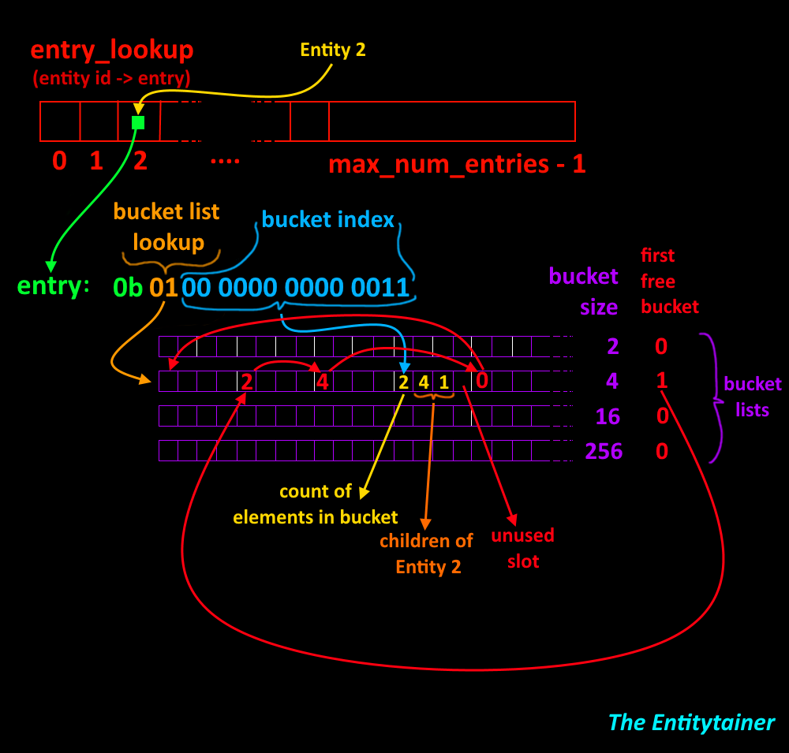

# The Entitytainer

:bowtie:

A single header library for managing entity hierarchies.
A C99 single header library for managing entity hierarchies.

Basically a multimap (not really) implementation in C, aimed at game development.

Its main purpose is to keep track of hierarchies of entities. This can be useful for:

* Attachments (e.g. holding a weapon in the hand) i
* Inventory (having a piece of cheese in a bag in the backpack on the back of a character)
* A workplace hierarchy, keeping track of who's the boss of who, for example.
* Managing a files-and-folders structure (not necessarily related to either games or entities!)

## Problem statement

You want a one-to-many relationship but you don't want lots and lots of small array allocations.

For example, let's say you are trying to add support for characters in your game to have an inventory. Of course you want to do this by placing zero or more entities (items) into your inventory. Furiously, you start typing. Hours later you gaze upon your creation:

```C
typedef int Entity;

struct Inventory {
    Entity m_Entity;
    std::vector<Entity> m_ItemEntities;
};

struct InventorySystem {
    std::vector<Inventory> m_Inventories;
};
```

You realize that this is bad. And not just because you're using STL. But how to do it properly?

This is what The Entitytainer solves.

## Features

* It only needs one allocation.
  * It's up to the application to decide on an appropriate size beforehand. This means it's using more memory than necessary until you start to fill it up. On the other hand, generally you have a worst case that you need to handle anyway. ¯\\\_(ツ)_/¯
* Can be dynamically reallocated (i.e. grown) - controlled by application.
  * And it's pretty quick too, just a couple of memcpy's.
* A hierarchical bucket system is used to not waste memory.
* O(1) lookup, add, removal.
  * That said, you have to pay the price of a few indirections and a bit of math. Only you and your platform can say whether that's better or worse than a lot of small allocations.
* Reverse lookup to get parent from a child.
* C99 compatible (or aims to be).
* Platform agnostic (or aims to be).
* Zero dependencies.
* Built with maximum/pedantic warnings, and warnings as error.
* Code formatted with clang-format.
* There are unit tests!
  * They all pass.
  * They should cover most things but there could be cases I haven't tried yet.
* Now optionally supports child lists with holes, for when you don't want to rearrange elements when you remove something in the middle.
* Politely coded:
  * C99 compatible (or aims to be).
  * Platform agnostic (or aims to be).
  * Zero dependencies.
  * Built with maximum/pedantic warnings, and warnings as error.
  * Code formatted with clang-format.
  * There are unit tests!

## Current status

Seems to work.

## Known issues

* Only tested on Windows 10 using VS 2017 running x64.
* Only unit tested - not integration tested.
* Reallocation is currently commented out due to some refactoring.
* API is not finalized. Would like to add a bit more customization and allow for passing in arrays of entities instead of one at a time.
* Improper single-header-style exposure of API.

## Fun facts

* I wrote almost the whole thing without compiling it once. It's kinda relaxing to work that way, not thinking too hard about syntax errors etc, just writing the code. Of course, writing it was the easy part. Making it actually work was the other 90%.
* Most of The Entitytainer was written on the bus.
* The name is a pun of entities and containers. If it wasn't obvious. Credit for this amazing name goes to @fzetterman from this thread: https://twitter.com/Srekel/status/919845253032660993

## How to use

```C
int   max_num_entries     = 1024;
int   bucket_sizes[]      = { 4, 16, 256 };
int   bucket_list_sizes[] = { 4, 2, 2 };
int   needed_memory_size  = entitytainer_needed_size( max_num_entries, bucket_sizes, bucket_list_sizes, 3 );
void* memory              = malloc( needed_memory_size );
TheEntitytainer* entitytainer =
  entitytainer_create( memory, needed_memory_size, max_num_entries, bucket_sizes, bucket_list_sizes, 3 );

entitytainer_add_entity( entitytainer, 3 );
entitytainer_add_child( entitytainer, 3, 10 );

int                    num_children;
TheEntitytainerEntity* children;
entitytainer_get_children( entitytainer, 3, &children, &num_children );
ASSERT( num_children == 1 );
ASSERT( children[0] == 10 );

```

## How it works

This image describes it at a high level.



Not that you need me to explain in text what is so clearly described in the image, but...

First you decide how many *entries* you want. This is your maximum entity count. Note, it's NOT the maximum amount of entities you will maximally put into the entitytainer. At some point I might fix hashing but for now it's just a direct lookup based on the entity ID.

This number is used to create an array of *entries*. An entry is a 16 bit value that contains of two parts: The bucket list lookup and the bucket index.

The *list lookup* is 2 bits and shows which *bucket list* the entity's children are stored in. In the image example, **Entity 2**'s children are stored in the second bucket list (index 1).

The *bucket index* says which bucket in the bucket list the children are stored at. To look up the children of an entity, you first get the bucket list, and then the bucket inside that list.

The bucket consists of a number of elements. The first one is a *counter*, saying how many children there are. This is a simple way of storing the size so The Entitytainer doesn't has to iterate every time to figure it out. It's a bit wasteful in memory but it makes things a bit easier.

After the *counter* comes the children.

Each bucket list has buckets of different sizes. When a child is added to an entity and the bucket is full, the bucket is copied to a new bucket in the next bucket list. Note that you probably don't want your first bucket list to have bucket size 2, like in the image, unless it's *very* common to have just one child. Also, this means that if you add more children than the last bucket list can have (256 in the image), The Entitytainer will fail an ASSERT.

### Memory reuse

When you remove an entity, its bucket will of course be available to be used by other entities in the future. The way this works is that each bucket list has an index to the *first free bucket*. When you free a bucket, the bucket space is *repurposed* and the *previous value* of the first free bucket is stored there. Then the first free bucket is re-pointed to your newly freed bucket. I call this an *intrinsically linked bucketed slot allocator*. Do I really? No. Maybe. Is there a name for this?

It's kinda neat because it's fast to "allocate" or deallocate a bucket, and yet it needs practically no memory for bookkeeping.

## But it's not really a multimap is it?

No, not really. Cause it'll complain (or ought to) if you assign the same child to two different parents. (Just to be clear - you can have deeper-than-one hierarchies though.)

## License

Dual licensed under Public Domain and MIT.
